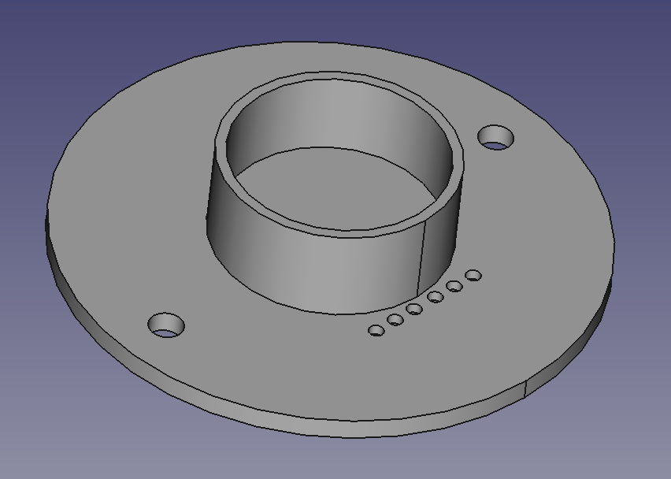
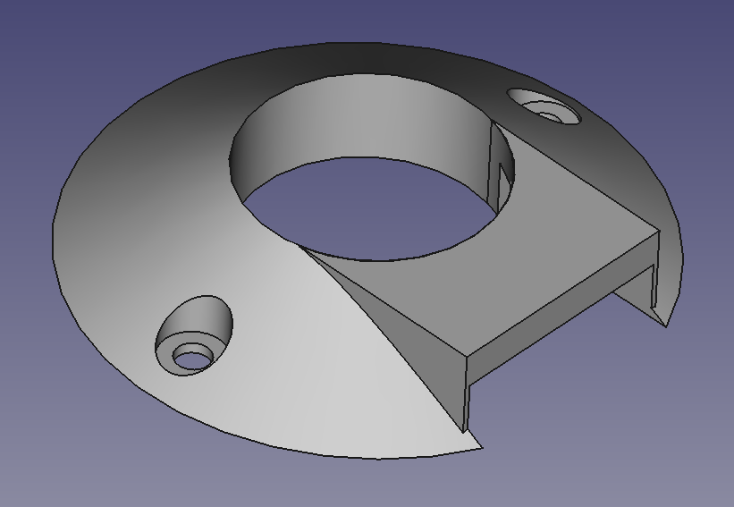
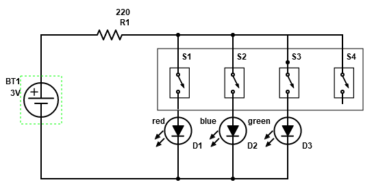

# Crystal Box
*Modding an ordinary wooden box with a shiny glowing crystal for Mimi*
****
## About
`Crystal Box` is a project to turn a little wooden box, a shard of glass, an LED and a battery into a cool looking mini-lamp which fractures light. It involves getting a piece of rugged glass to stick to the top of a box with an LED underneath, which is made possible by various 3D-prints.

**The box:**

**The crystal:**

**Concept:**

****
## Why?

Mimi collects wooden boxes and weird rocks from the beach. This time, she stumbled upon a piece of glass which apparently has been a victim to the tides for some years. Needless to say, it's worthless, but might refracture light from a light source pretty well, which is the central idea behind all of this. Combining this with a wooden box could make for a cool looking mini-beacon for the living room. And since the estimated cost of 3D-prints and a little LED lies in the cents-realm, it explains itself why this project should happen. This will be my gift to her for christmas of 2021.

****
## 3D-Print

The print includes a transparent base which encapsulates the LED and forms the "pool" in which the crystal will form a solid connection with epoxy or glue. The LED shines through the print and is therefore protected from the glue. On top of this sits a non-transparent print which looks nicer and hinders the light from shining through the base print. A small strip is left open to give it some `4000$ RGB gamer pc` vibes.

**Transparent base model:**

**Cover model:**

**Prints:**

While in development a hotfix had to be applied. The electronics take up too much vertical space, which means that a ring of 2mm thickness had to be added. This is visible in "Electronics".

****
## Electronics

Electronics are straight forward: Button-cell into resistor into 4-pole switch into RGB-LED. This enables the box to be lit in RGB while only using one resistor, absolutely nothing fancy. Here you would insert an analog transistor-RC circuit or digital logic for the full potential of this LED.

**Schematic**

**Wiring**

****
## Pictures

**1st concept with LED**

**Battery holder**

**Finished box in red**

**Inside the box**

## Conclusion
>Is this efficient?

>Is this clever?

>Is this peak electronics?

Most likely not. However, this is a unique piece of electronics/print/whatever, which is what really counts in this case. 